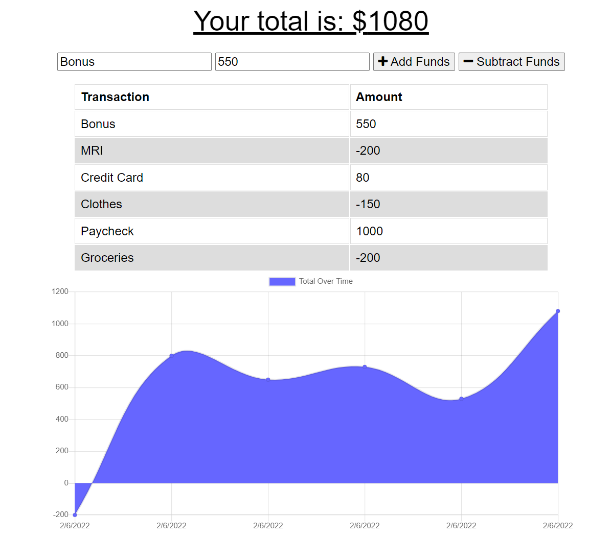

* You should add your idb.js file to the public/js/ directory of your application.
* You should add your service worker to the root of the public/ directory of your application.
* Deploy to Heroku when done

# Budget Tracker
An easy way to track your finances while travelling. This app can be used with and without internet. 

# Links
* GitHub:
* Deployed Link: 

# Description
 
Here is a snapshot of the app in action.

# Technologies Used
* CSS
* Heroku
* HTML
* JawsDB
* JavaScript
* Json
* MongoDB

# Installation
* I downloaded the necessary technologies to start up this app.
* Then, I created the folders and files to hold all the information.
* For uploading, I downloaded JawsDB, and Heroku. 

# Process
* I downloaded the starter code
* Then, I created the manifest.json, and updated the code where needed.
* I tested the app to make sure it worked offline.

# Credits
Made by: Katrina Rodriguez